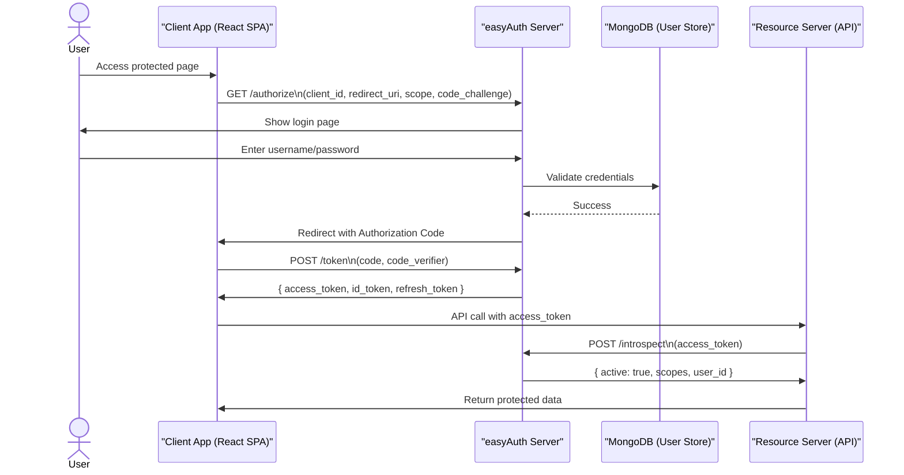

# easyAuth

A minimal OAuth 2.0 + OpenID Connect (OIDC) provider built with Node.js, Express, TypeScript, and MongoDB. Includes:
- Production-ready server (authorization, token, userinfo, JWKS, introspection, revocation, OIDC logout)
- Examples folder with a React SPA and an Express backend proxy demonstrating the Authorization Code flow
- Docker support for the server (with MongoDB inside the same container) and for the examples bundle

## Repository layout
```
.
├── server/            # OIDC/OAuth2 provider (TypeScript)
│   ├── src/           # Controllers, models, routes, middleware, views
│   ├── dist/          # Compiled output
│   ├── Dockerfile     # Runs MongoDB + Node app in one container
│   └── README.md      # Full server documentation
└── examples/          # React SPA + backend proxy demo
    ├── backend/       # Express proxy for code exchange and userinfo
    ├── web-client/    # Vite React app (login + callback + profile)
    ├── Dockerfile     # Builds web and runs both services in one container
    └── README.md      # How to run the demo
```

## Quick start (server)

Local (Node):
```
cd server
npm install
npm run build
npm start
```
The server listens on http://localhost:3000.

Docker (server + MongoDB in one container):
```
cd server
# Build
docker build -t easyauth-server .
# Run (exposes 3000 for app, 27017 for MongoDB)
docker run --rm -p 3000:3000 -p 27017:27017 easyauth-server
```
For more options (environment variables, persistence), see `server/README.md`.

## Endpoints (high-level)
- /oauth/authorize — Authorization Code flow (requires openid scope)
- /oauth/token — Token endpoint (authorization_code, refresh_token)
- /oauth/userinfo — Standard OIDC user claims
- /oauth/.well-known/openid-configuration — Discovery
- /oauth/jwks — JSON Web Key Set
- /oauth/introspect — Token introspection (RFC 7662)
- /oauth/revoke — Token revocation (RFC 7009)
- /oauth/logout — OIDC logout

See `server/README.md` for complete parameters and examples.

## Demo (examples)
Run the React + proxy demo with Docker:


```
# From repo root
docker build -f examples/Dockerfile -t easyauth-examples --build-arg VITE_CLIENT_ID=your_client_id .
docker run --rm -p 3001:3001 -p 3002:3002 \
  -e ISSUER=http://host.docker.internal:3000 \
  -e CLIENT_ID=your_client_id -e CLIENT_SECRET=your_client_secret \
  -e REDIRECT_URI=http://localhost:3001/callback \
  easyauth-examples
```
The web app will be available at http://localhost:3001 and the proxy at http://localhost:3002.

See `examples/README.md` for non-Docker steps and details.

## Security notes
- ID tokens are signed with RS256; access tokens default to HS256
- Rate limiting and Helmet headers are enabled
- Passwords are hashed with bcrypt

## License
ISC
